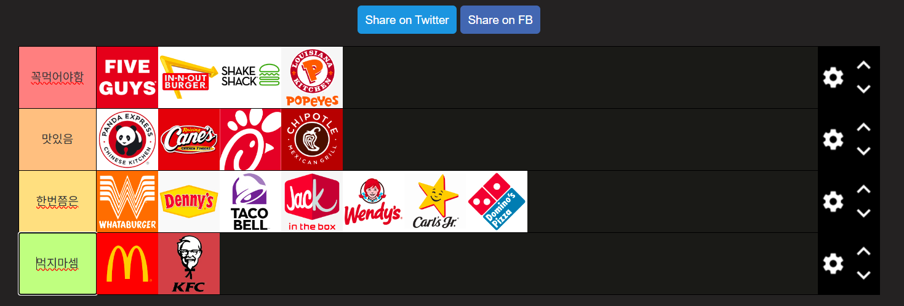

# 서론
글을 6월이 되어서야 쓰는데 

계절교양이 너무 노잼이라 쓰는 미국에서 먹었던 패스트푸드 티어표 정리

# 꼭먹어야함
우선 미국에서 지역을 서부, 남부, 동부로 나눌 수 있는데 각 지역마다 유명한 햄버거 집이 있다

## FIVE GUYS
파이브 가이즈는 프리피엄 패스트푸드점으로 다른 곳에 비해 가격이 좀 있지만 그만큼 햄버거중에선 제일 맛있었다. 미국 햄버거하면 바로 떠오르는 맛이라고 할 수 있다

## IN-N-OUT BURGERS
우리가 갔던 지역은 라스베가스고, 미국 서부이다

인앤아웃버거는 미국 서부를 대표하는 햄버거고 파이브가이즈보단 절제되고 담백한 맛이 있었다

## SHAKE SHACK
반대로 여기는 미국 동부를 대표하는 햄버거고. 맛은 파이브 가이즈랑 비슷하게 프리미엄 햄버거 맛이 난다.

## POPEYES
치킨으로 유명한 곳이다. 튀김유 바뀌기 전 BBQ 황금올리브치킨 맛과 유사했다.

# 맛있음
미국 와서 먹어볼만한 브랜드들이다.

## PANDAS EXPRESS
중국식 볶음밥 체인점인데 미국 현지화되서 호불호가 없을 맛이다.

주 식사(밥/면), 메인 메뉴(여러 종류의 고기)를 선호에 맞게 고를 수 있는 것도 재밌는 포인트이다.

## Raising Cane's Chicken Tender
치킨 텐더만 파는 MZ한 체인점인데 소스가 중독성이 있다고 바이럴되서 먹어봤다.

확실히 이전과 먹어본 소스랑 비교해 봤을 때, 특이한 느낌이고 후추 향이 인상적이였다.

## Chick-Pil-A
파파예스랑 비슷하게 치킨을 주로 파는 곳이다. 

여기도 맛있고 택할 수 있는 소스의 종류가 매우 많아서 선택하기 어려웠었다.

## CHIPOTLE
멕시칸 스타일 타코 체인점인데 그냥저냥 먹을 만 했다

햄버거 먹다가 이런 거 먹어주니깐 좀 나았다

# 한번쯤은
그냥 다 그냥저냥 먹을만한 곳인데 넣은 이유를 정리하다보면

1. 다른 햄버거 체인점에 비해 맛이 밀렸거나
2. 24시간 음식점이라서 맛 자체는 한계가 있을 수 밖에 없었다거나
3. 너무 평범한 맛이여서

이다.

# 먹지마셈
한국과의 다른 맛을 기대하고 오면 손해본다.

이 브랜드들은 한국에서만 먹자.

## 맥도날드
그냥 한국과 맛이 차이가 없어서 굳이 먹을 필요가 없다.

## KFC
미국에서의 두 번째 저녁이자 첫 번째 배달이였는데 미국의 맛은 역시 다르다고 느꼈다.

치킨도 간이 매우 쎘고 함께 제공된 빵의 간 또한 쎄서 감당이 안됬다.
